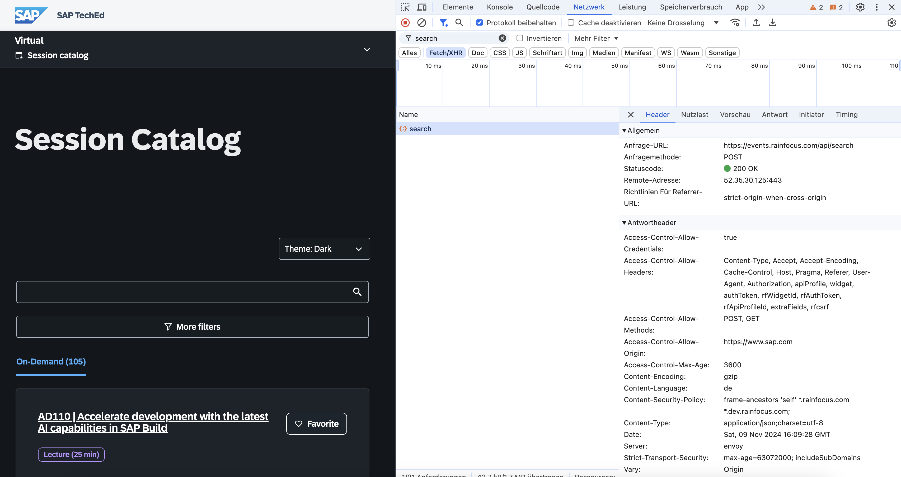
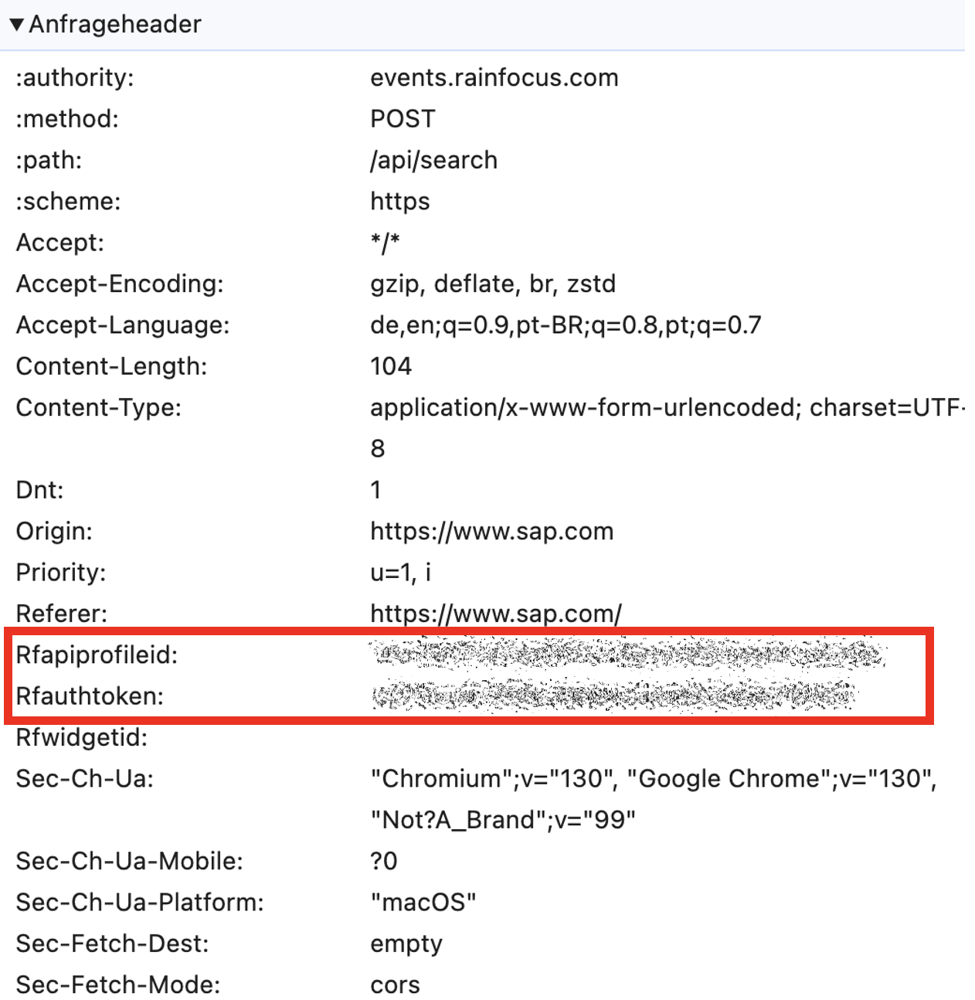
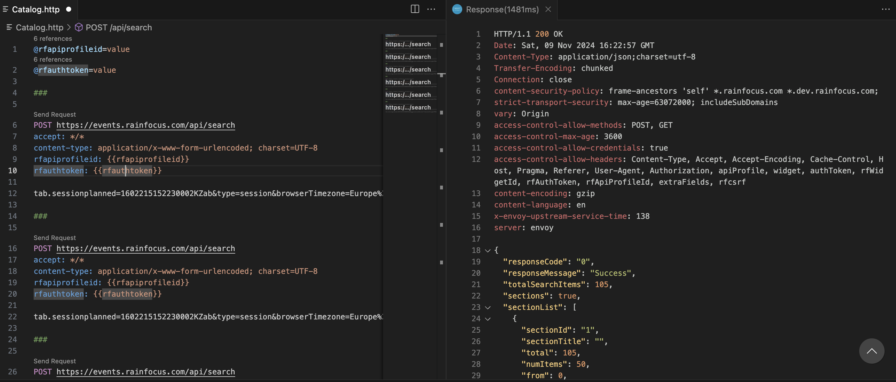
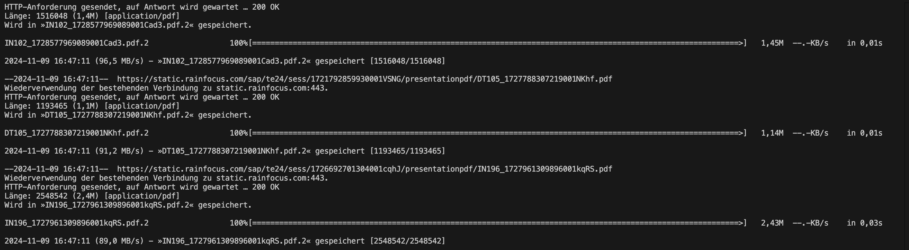

# SAP TechEd 2024 Virtual session material download

SAP TechEd is an SAP event for SAP developers and technical users. It allows to learn from industry leaders and to discover best practices. To participate, a free registration is needed. The sessions are available as on demand streams and the session material is available as a PDF download. A all-in-one download of the session PDFs is not provided. You need to access each session individually and download the PDF manually.

This project shows how to download the PDF session material from SAP TechEd 2024 virtual in an automated way. You need to have a registered user to access TechEd 2024 virtual and to access the session catalog. The PDFs are freely available to anonymous users. You only need to know the URL to download a PDF (see item '**Download PDFs using wget**' for more information)

## Access TechEd 2024 Virtual

Log in to TechEd virtual: https://www.sap.com/events/teched/virtual.html


## Download session catalog

Run a catalog search, open the browser network tab from the dev tools, look for a request to /api/search



From the request, take the HTTP headers

- rfapiprofileid
- rfauthtoken



Insert the values to Catalog.http

- @rfapiprofileid=your value for rfapiprofileid
- @rfauthtoken=your value for rfauthtoken

Run the HTTP requests from VS Code. Save the response to a file.



Saving all requests to a separate file will result in 6 JSON files. Format them to make the better readable. Use grep to extract the URLs from the JSON file.

## Extract URLs to PDFs and save to file

```sh
grep pdf *.json | grep -o 'https://[^"]*' > urls.txt
```

All links to PDFs are now in the file urls.txt. It contains 181 URLs. The file contains some duplicates. Maybe the catalog query isn't 100% or the skip query option is not working as expected. To sort out the duplicates:

```sh
sort -u urls.txt > pdfurls.txt
```

As the PDF files are accessible as anonymous user, the [file is added to this repo](./pdfurls.txt).

## Download PDFs using wget

To download the PDFs wget can be used. Simply provide the pdfurls.txt file as input and add --content-disposition to store them in a human readable name, in case SAP provides this name (nope, does not, but there is still hope). As PDFs are available publicly, no authentication required, only the URL must be known to download the documents.

To download the PDFs, just take the pdf url file and run wget:

```sh
wget --content-disposition -i pdfurls.txt
```


